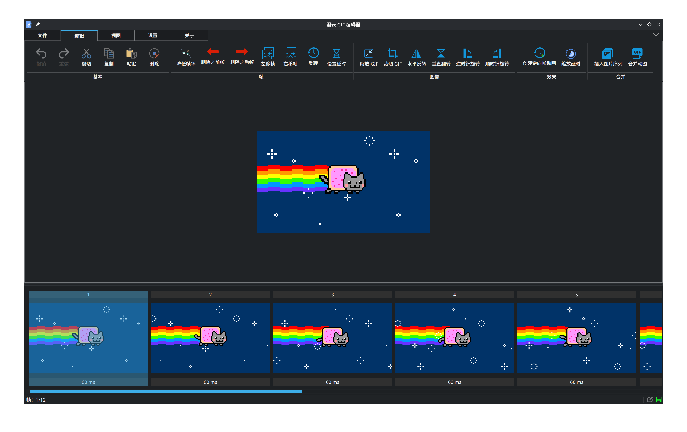

<h1 align="center"> WingSummer.WingGifEditor2</h1>

羽云 GIF 编辑器2

- 开源不易，给个 Star 或者 [捐助](#捐助) 吧

## WingGifEditor2

&emsp;&emsp;本软件是基于 QT C++ 编写的 GIF 编辑器，采用 C++ 进行开发。`Windows`上有一个十分强大都既是 GIF 录屏工具又是强大 GIF 编辑器`ScreenToGif`。但 Linux 上只有强大的 GIF 录屏工具，但没有简单好用满足基本编辑需求带有图形界面的 GIF 编辑器。于是乎，我给开发了一个简易的 GIF 编辑器，它具有基本的编辑功能，简单方便。

&emsp;&emsp;相对于老版本的`WingGifEditor`，它修复了一些 Bug，并且具有了小小的插件系统，用于实现扩展图像编辑。并且具有更现代的用户界面，更快的 Gif 图像加载速度和保存速度以及相对较低的内存占用，更好的图像编辑体验。

&emsp;&emsp;有关本软件提建议的时候不要天马行空，本软件的定位是提供简单易用满足基本需求的 GIF 编辑器，并不是像`ScreenToGif`，一是没有相关基础知识，自己一个人搞不动；二是没必要，我不想把这个软件搞个大而全，配合`Gimp`等优秀的图像编辑器作为辅助，来编辑 GIF 图像绰绰有余了。

### GIF 库

&emsp;&emsp;基于 [qgiflib](https://github.com/igormironchik/qgiflib) 修改得到，感谢里面提供了大量的保存 GIF 代码可供参考，保证了保存图像的质量。

### 参与贡献

1. 如果您有想参与本软件代码开发递交，请在 pull request 联系我。
2. 本项目支持捐助，如有意愿请到本仓库通过微信或者支付宝的方式进行，一瓶水的价钱足以提高我的维护该项目的热情，感谢大家的支持。
3. 如果您想提交修复或者增进程序的代码，请在 pull request 递交。
4. 任何成功参与代码 Bug 修复以及增进程序功能的同志和 Sponsor ，都会在本仓库 ReadMe 和附属说明文件中体现，您如果是其中之一，本人可以按照您合理的意愿来进行说明。
  

**加入我们并不意味着就是代码的维护，你可以选择下列一项或多项进行参与：**

1. 代码维护：实现新功能或修复 BUG ，对代码进行维护和升级。
2. 文档编辑：主要是接口文档和教程需要撰写编辑，这很重要。
3. 参与讨论：主要是讨论本项目未来发展和方向等。
4. 编写插件：一起增强该软件的功能。

### 打包者必读

&emsp;&emsp;首先，我对你的热心帮助表示真挚的感谢。作为一个自由软件，你可以在遵守开源协议和精神的条件下，无需告知我就可以打包并通过合法渠道进行分发。你可以在打包信息里包含自己的信息，但是，你必须遵守以下作为该软件的作者我的约定：

1. 软件包必须包含`LICENSE`、`authorband.svg`、`licenseband.svg`、 `screenshot.png`和`README.md`这几个文件，且都放到和主程序一致的目录下。这些文件都在项目的根目录下，直接复制就行了。
2. 除非事前声明该软件已经被二次修改，打包的二进制安装包中不得含有经修改后源码编译的主程序。
3. 打包后的二进制安装包不得含有侵犯他人合法权益的内容，比如向其加入未经授权的付费内容或计算机病毒等。
4. 包内最好含有主程序的校验和，但不强求。
5. 无论是哪种打包形式，都一定要声明其开源协议和自由属性，不得隐藏而借机收费。虽然收费我并不反感，下载服务器还是需要资金维护的，但借着信息差骗人收费，这是我极其深恶痛绝的。
6. 无论以任何为目的，如未获得我作者的授权，不得修改任意程序内指向的网络链接和软件关于信息，比如赞助和关于软件部分的内容等。
7. 不得在安装程序内插入任何含有商业推广的插件，并且严格遵守第二条内容。

### 协议

&emsp;&emsp;本软件仓库遵循`AGPL-3.0`协议，不得将本软件用于协议之外的用途。

## 效果图

羽云 GIF 编辑器2

## 捐助

**
您的每一份支持都将是本项目推进的强大动力，十分感谢您的支持
**

感谢支持

感谢支持

## 有关仓库

- Github : <https://github.com/Wing-summer/WingGifEditor2>
- Gitee : <https://gitee.com/wing-cloud/WingGifEditor2>

## WIKI

&emsp;&emsp;点击 [此链接](https://github.com/Wing-summer/WingGifEditor2/wiki) 来进行学习使用，可视化的编辑 GIF 。
